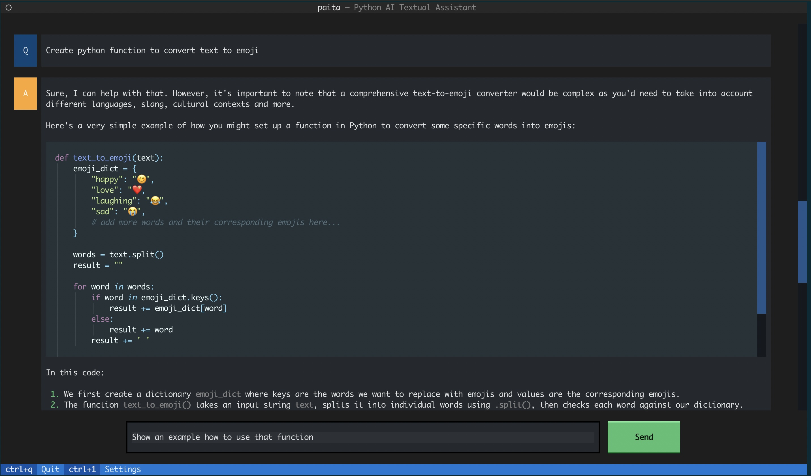

# Paita - Python AI Textual Assistant


Paita is textual assistant for your terminal that supports multiple AI Services and models.

## Key Features
1. **Supports Multiple AI Services:** Paita integrates with a variety of AI services through the [LangChain](https://python.langchain.com) library. If AI service is compatible with LangChain then it can be used also with Paita. Currently OpenAI and AWS Bedrock models are supported.
3. **Textual User Interface on your terminal:** Paita is based on [Textual](https://textual.textualize.io/) and provides a sophisticated user interface right within your terminal, combining the complexity of a GUI with console simplicity.                                                                                       
5. **Cross-Platform Compatibility:** Paita is compatible with Windows, macOS, and Linux systems across most terminals; if Python runs in your environment and Textual supports it, then Paita will work.

### Supported AI Services
* OpenAI
* AWS Bedrock
* (More to come soon...)

## Getting Started

### Prerequisites
- Python 3.8.1+
- Access to AI Service and configured in terminal

### Installation and running

Install using pip (or pipx)
```
pip install paita
```

Run and enjoy!
```
paita
```

### Configuring AI Service(s) and model access

#### OpenAI

OpenAI usage requires valid api key in environment variable.
```
export OPENAI_API_KEY=<OpenAI API Key>
```

#### AWS Bedrock

Enable AI model access in AWS Bedrock. Configure aws credential access accordingly.
